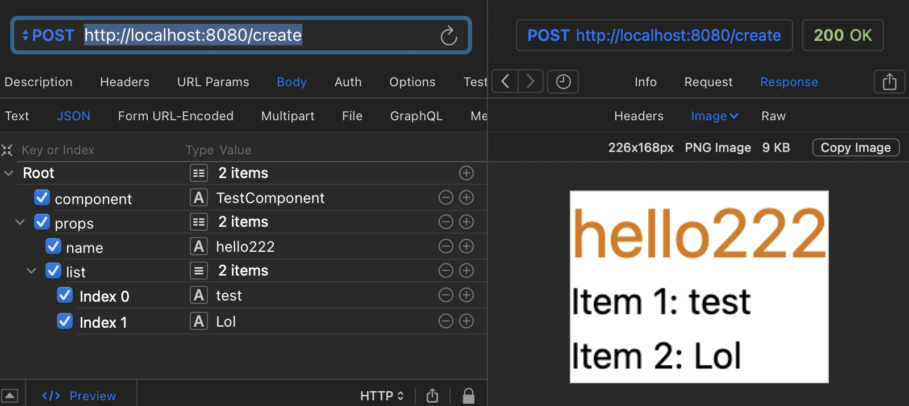

# React to Image

[WIP] A Node.js server leveraging [Puppeteer](https://pptr.dev/) for capturing and returning screenshots of [React](https://react.dev/) components, with seamless [UnoCSS](https://unocss.dev/) integration.



## Usage

```bash
pnpm install && pnpm build && pnpm start
# or use `esno` to run TS directly
pnpm install && pnpm dev
```

## API

### `POST https://localhost:8080/create`

Create a screenshot of a React component.

#### Request

```json
{
  "component": "TestComponent", // The name of the component, in PascalCase
  "props": {
    "name": "hello",
    "list": ["test", "lol"]
  }
}
```

You can add more components by adding more `React Pure Components` in `src/components`.

> TODO: Add more endpoints.

#### Response

An image file.

## License

MIT
