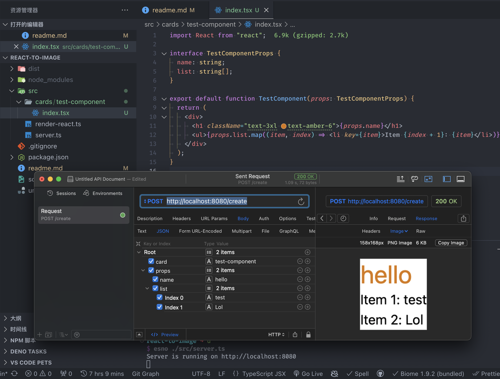

# React to Image

A Node.js server that use `puppeteer` to take a screenshot of a `React` component and return it.



## Usage

```bash
pnpm install && pnpm build && pnpm start
# or use `esno` to run TS directly
pnpm install && pnpm dev
```

## API

### `POST https://localhost:8080/create`

Create a screenshot of a React component.

#### Request

```json
{
  "card": "test",
  "props": {
    "name": "hello",
    "list": ["test", "lol"]
  }
}
```

You can add more cards by adding more `React Pure Components` in `src/cards`.

> TODO: Add more endpoints.

#### Response

An image file.

## License

MIT
